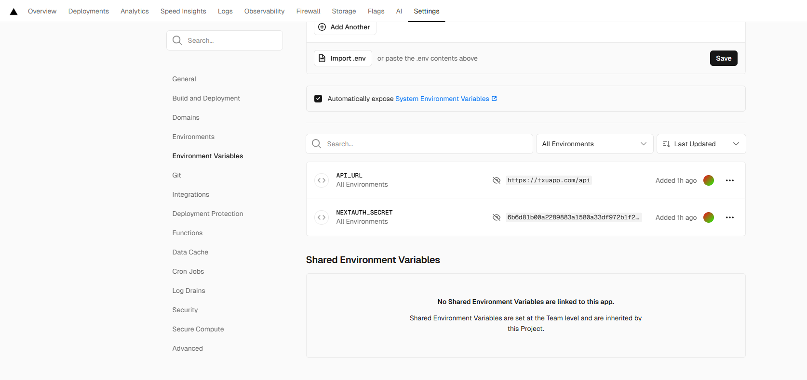

Để deploy ứng dụng trên môi trường production của vercel,
thì trong vercel cần thêm các biến môi trường cần thiết để chạy ứng dụng, bao gồm:
1. API_URL: https://txuapp.com/api
2. NEXTAUTH_SECRET: 6b6d81b00a2289883a1580a33df972b1f2d3949c4019c04ffdc1aefbed3a147c
