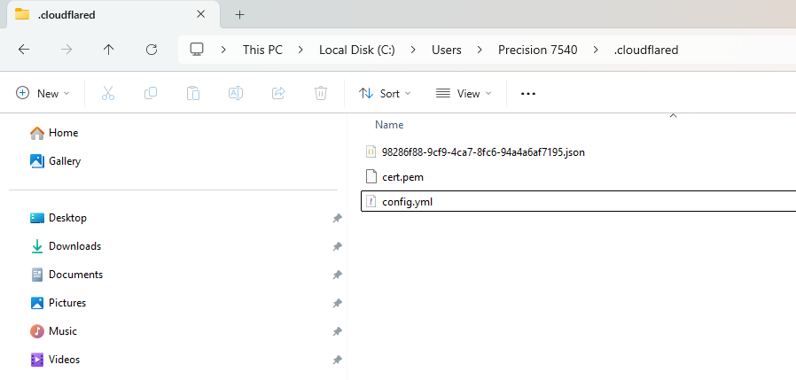
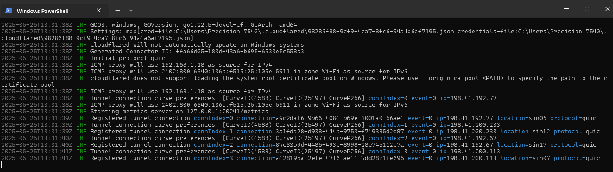

## Cấu hình domain cho frontend và backend
### Sử dụng domain `txuapp.com` cho ứng dụng frontend và `api.txuapp.com` cho ứng dụng backend

- Ứng dung frontend được deploy trên vercel, ứng dụng backend sẽ chạy ở local và dùng cloudlared để expose ứng dụng ra global,
cho phép ứng dụng frontend có thể gọi được ứng dụng backend

- Để thực hiện yêu cầu trên ta sẽ cấu hình Nameservers của domain cho phép cloudlared cấu hình dns bằng cách 
thêm dns của cloudlare vào domain (mua tại hostinger). Hai dns cần thêm vào domain là `imani.ns.cloudflare.com` và `yew.ns.cloudflare.com`.
- 
- Trước khi thêm dns của cloudlare vào domain trên hostinger, cần đăng nhập vào cloudlare, sau đó thêm domain vào cloudlare
và hoàn thành plan (free hoặc có phí)

- Sau khi thực hiện các bước trên thì ta có thể cấu hình dns của domain thông qua cloudlare. Đầu tiên ta sẽ
thêm 02 records để có thể trỏ domain `txuapp.com` hoặc `www.txuapp.com` tới ứng dụng frontend trên vercel.

|  Type   |     Name     |        Content         |
|:-------:|:------------:|:----------------------:|
|    A    |  txuapp.com  |      76.76.21.21       |
|  CNAME  |     www      |  cname.vercel-dns.com  |


Tiếp theo để có thể trỏ subdomain `api.txuapp.com` về ứng dụng backend chạy ở máy local,
ta cần thực hiện các bước sau:
1. Tải ứng dụng cloudlare về máy (windows hoặc linux, trường hợp này là windows, cấu hình biến môi trường nếu cần)
2. Chạy lệnh `cloudflared login` để login vào cloudlare thông qua trinhg duyệt đã được đăng nhập trước đó.
Trình duyệt sẽ mở ra, bạn chọn domain txuapp.com và cấp quyền. Sau khi login xong, một chứng chỉ sẽ được lưu ở ~/.cloudflared/cert.pem
4. Chạy lệnh tạo tunel `cloudflared tunnel create txuapp-be`. Lệnh này sẽ tạo một tunel `txuapp-be`, có id và file json trong thư
mục `cloudlared` như hình

6. Tiếp theo cần cấu hình tunel trong file `config.yml` với nội dung 
```
tunnel: 98286f88-9cf9-4ca7-8fc6-94a4a6af7195
credentials-file: "C:\\Users\\Precision 7540\\.cloudflared\\98286f88-9cf9-4ca7-8fc6-94a4a6af7195.json"
ingress:
  - hostname: api.txuapp.com
    service: http://localhost:8080
  - service: http_status:404
```
7. Sau khi thêm file cấu hình, thì ta tạo record dns `api.txuapp.com` gắn với tunel đã tạo ở bước trên. Lệnh tạo record
`cloudflared tunnel route dns txuapp-be api.txuapp.com`. Lệnh này sẽ tạo record dns `api.txuapp.com` trên dns cloudlare
và gắn với tunel đã tạo. Bước tiếp theo sẽ chạy tunel để trỏ subdomain `api.txuapp.com` về máy local bằng lệnh
`cloudflared tunnel run txuapp-be

Hoặc có thể chạy tunnel với file cấu hình như sau:
```
cloudflared tunnel --config config-api.yml run
cloudflared tunnel --config config-jenkins.yml run
```